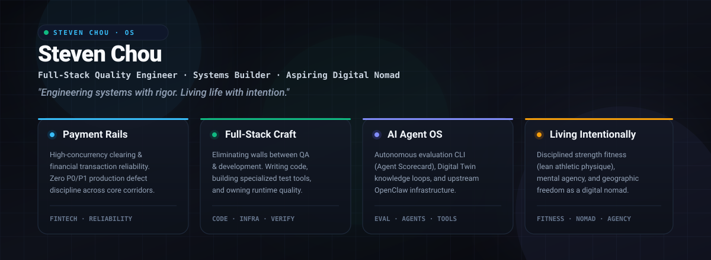
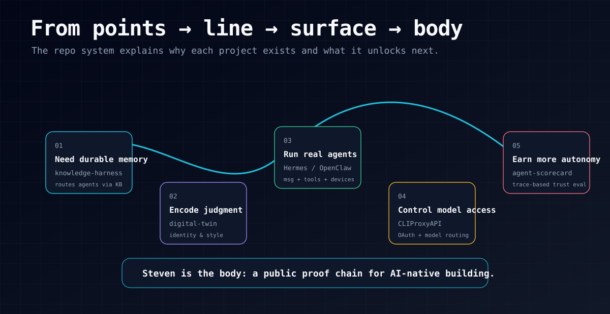
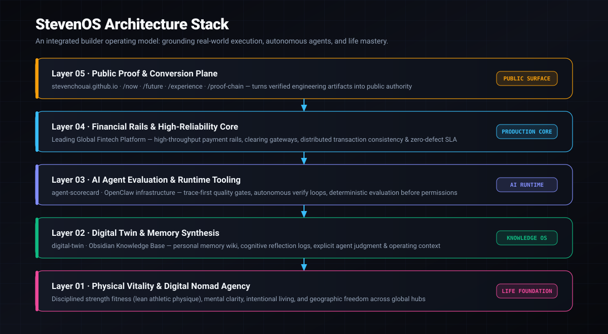

<p align="center">
  
</p>

# Steven Chou

**I build Personal AI Operating Systems: memory → agents → evaluation → public proof.**

If you are deciding whether to follow or work with me, the short version is:

> I turn AI-agent ideas into inspectable systems: captured knowledge, explicit identity, real tool use, eval gates, and public proof that compounds over time.

## Start here: three things you can inspect

- **[Agent Scorecard](https://github.com/stevenchouai/agent-scorecard)** — run the examples and inspect the reports that check whether an agent used tools, verified its work, and left useful files behind.
- **[Digital Twin](https://github.com/stevenchouai/digital-twin)** — inspect the file-first workflow for giving personal agents reusable instructions, memory, and output habits.
- **[Hermes agent PR #21254](https://github.com/NousResearch/hermes-agent/pull/21254)** — review the merged fix for safer non-interactive agent updates and the discussion behind it.

## 60-second proof route

If you only have a minute, click these in order:

1. **[Agent Scorecard](https://github.com/stevenchouai/agent-scorecard)** — open the examples and reports. Verify that agent work is checked by files, tool calls, and final output, not just by a good-looking answer.
2. **[Digital Twin](https://github.com/stevenchouai/digital-twin)** — scan the README and docs. Verify that reusable agent behavior is written down in public files someone else can inspect.
3. **[Hermes agent PR #21254](https://github.com/NousResearch/hermes-agent/pull/21254)** — read the merged PR and changed files. Verify that I can land a small reliability fix in a real assistant codebase.

## Why Stay Here

| Visitor question | What this profile should prove |
|---|---|
| **Can he build?** | Public repos, working demos, diagrams, tests, and writeups instead of claims. |
| **Does he understand agents deeply?** | Agent architecture research, runtime plumbing, and trace-first evaluation. |
| **Is there a coherent direction?** | Every project rolls up into one Personal AI OS thesis, not random side projects. |
| **Should I follow?** | Follow if you care about AI agents becoming reliable personal/work infrastructure, not just chat UI demos. |

## The Shape of the Work

<p align="center">
  
</p>

```text
point:   individual tools and experiments
line:    memory → identity → agents → evals → proof
surface: repos, writing, demos, resume, and operating loops reinforce each other
body:    Steven as one inspectable AI-native builder entity
```

## StevenOS Stack

<p align="center">
  
</p>

| Layer | Repository / Surface | Role in the system | Public conversion asset |
|---|---|---|---|
| Memory | knowledge-harness *(local hardening before public release)* | Routes agents through an Obsidian-backed knowledge base without mixing content and runtime state. | Architecture note + public-safe demo pending. |
| Identity | [digital-twin](https://github.com/stevenchouai/digital-twin) | File-first operating layer for making agents inherit style, judgment, memory, and reusable workflows. | README, docs site, operating-layer essay. |
| Agent runtime | Hermes / OpenClaw contributions | Real assistant plumbing: messaging, Feishu threads, gateway/runtime debugging, OAuth, CLI backends, tools. | Issue/PR writeups and debugging notes pending. |
| Model + tool infra | CLIProxyAPI *(public surface pending cleanup)* | Normalizes model access and CLI-compatible API infrastructure. | Cleanup checklist + launch note pending. |
| Evaluation | [agent-scorecard](https://github.com/stevenchouai/agent-scorecard) | Trace-first quality gate for deciding whether agents deserve more tokens, permissions, and autonomy. | Runnable examples + reports. |
| Public proof | [stevenchouai.github.io](https://stevenchouai.github.io) · resume system | Converts repos, essays, demos, and job-market artifacts into one navigable proof chain. | Homepage, blog, proof-chain page. |

## Featured Proof

### Agent systems

- **[Agent Scorecard](https://github.com/stevenchouai/agent-scorecard)** — deterministic checks for tool use, verification, durable artifacts, side-effect safety, and anti-busywork behavior.
- **[Claude Code Sourcemap](https://github.com/stevenchouai/claude-code-sourcemap)** — source-map-based architecture guide for AI coding agents.
- **Hermes / OpenClaw work** — practical runtime and gateway fixes across real assistant stacks, not toy demos.

## Open Source Contributions

| Project | Contribution | Status | Why it matters |
|---|---|---|---|
| [NousResearch/hermes-agent](https://github.com/NousResearch/hermes-agent) | [#21254](https://github.com/NousResearch/hermes-agent/pull/21254) — `fix(update): migrate config in non-interactive updates` *(salvaged from my original #19221)* | **Merged** · merge commit `8cef149` | Makes detached / gateway / non-interactive update flows safer by migrating config before restart. |
| [NousResearch/hermes-agent](https://github.com/NousResearch/hermes-agent) | [#17895](https://github.com/NousResearch/hermes-agent/pull/17895) — `fix(feishu): preserve threaded replies` | **Open** | Preserves Feishu/Lark threaded reply routing for real agent gateway conversations. |
| [openclaw/openclaw](https://github.com/openclaw/openclaw) | [#75024](https://github.com/openclaw/openclaw/pull/75024) — `fix(feishu): preserve threads without root_id` | **Open** · CI green-ish | Handles Feishu/Lark thread fallback behavior in another production-style agent runtime. |

### Personal AI infrastructure

- **[Digital Twin](https://github.com/stevenchouai/digital-twin)** — a personal agent operating layer built around explicit files, skills, memory, and durable outputs.
- **knowledge-harness** *(local hardening before public release)* — CLI/runtime wrapper around an Obsidian LLM wiki.
- **Input Copilot iOS** *(local proof)* — capture → profile signal → radar → Obsidian export loop.

### Career and communication systems

- **Resume system** *(public writeup pending)* — dual-track PM / Engineer resume workflow with local JD matching, AI tailoring, ATS review, and reproducible PDF output.
- **ManageUp** *(archive / visibility pending)* — MCP server + skill library for manager-facing reporting.

## Follower Growth Loop

I do **not** expect followers to come from a prettier README alone. The loop has to be:

1. **Build useful primitives** — agent memory, identity, runtime, eval, and proof-chain tools.
2. **Publish one concrete artifact per week** — a repo improvement, demo, architecture note, benchmark, debugging case, or before/after workflow.
3. **Package each artifact into a small distribution unit** — GitHub README update + blog note + X/LinkedIn thread + one clear screenshot/diagram.
4. **Route readers back to the proof chain** — every post should answer: “what can I inspect or reuse now?”
5. **Measure retention signals** — stars, follows, profile clicks, repo clones, comments, inbound DMs, and which pages cause people to continue reading.

## 30-Day Public Build Plan

| Week | Ship | Why it should help conversion |
|---|---|---|
| 1 | Add clear visitor CTA, proof map, and follower thesis to this profile. | People understand the category and why to follow within 10 seconds. |
| 2 | Harden one local proof repo into a public artifact or public writeup. | Converts “interesting private system” into inspectable evidence. |
| 3 | Publish one agent-eval case study using Agent Scorecard. | Shows judgment: not just building agents, but deciding when they deserve trust. |
| 4 | Turn one runtime/debugging win into a practical architecture note. | Attracts expert builders who follow for hard-earned implementation detail. |

Success metric: each shipped artifact should create a visible next click — repo → demo/report → essay → follow/contact. If it cannot create a next click, it is probably internal value, not public conversion value yet.

## Operating Principles

- **Trace over vibes** — logs, tests, files, reports, screenshots, and commits beat confident claims.
- **Coherence over volume** — every project should explain its upstream and downstream role.
- **Small tools before dashboards** — build the proof loop before polishing the surface.
- **AI as leverage, not theater** — an agent earns autonomy only by producing verified artifacts.

## Selected Writing

- [Claude Code source deep dive](https://stevenchouai.github.io/blog/claude-code-source-deep-dive)
- [Digital Twin operating layer](https://stevenchouai.github.io/blog/digital-twin-operating-layer)
- [AI reshapes engineering SDLC](https://stevenchouai.github.io/blog/ai-reshapes-engineering-sdlc)
- [Public proof chain](https://stevenchouai.github.io/proof-chain)

## Follow / Contact

- Website: [stevenchouai.github.io](https://stevenchouai.github.io)
- GitHub: [github.com/stevenchouai](https://github.com/stevenchouai)
- Follow for: AI agents · evaluation · personal knowledge systems · product engineering · public proof chains
